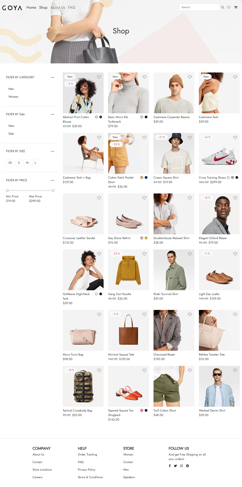
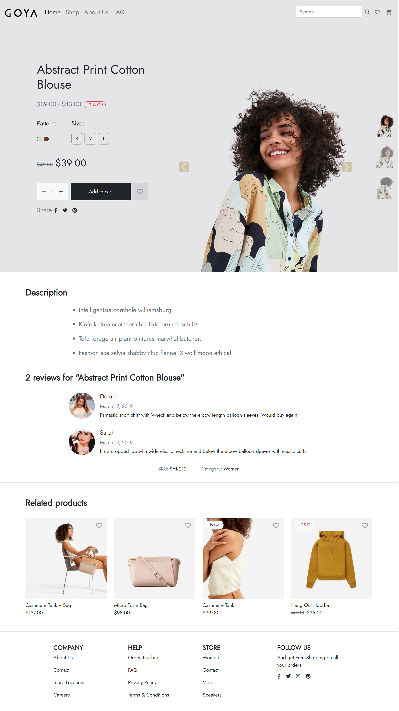
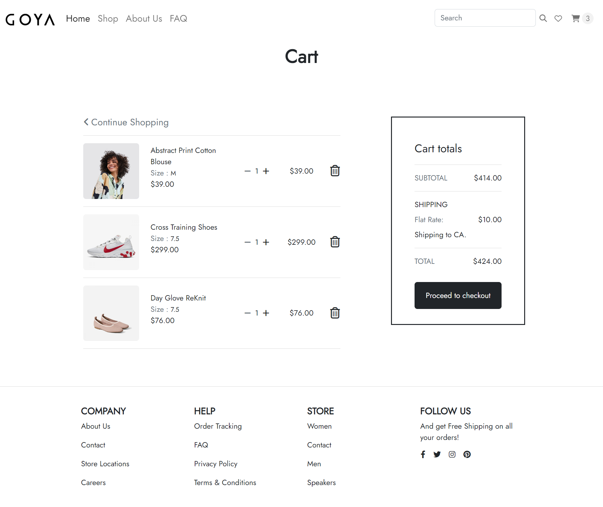
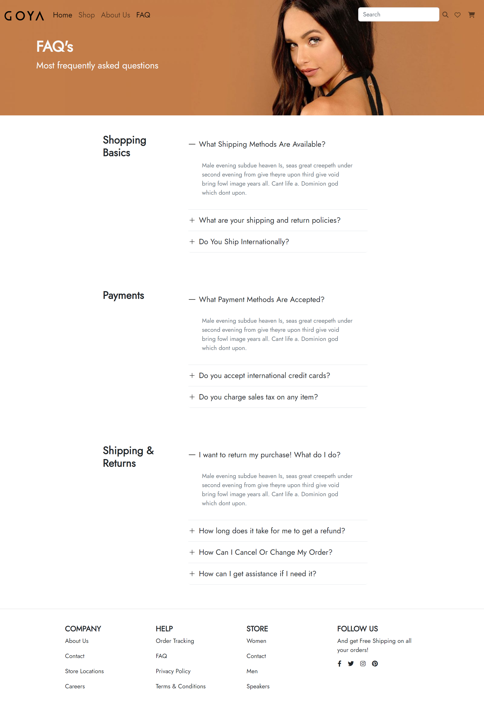
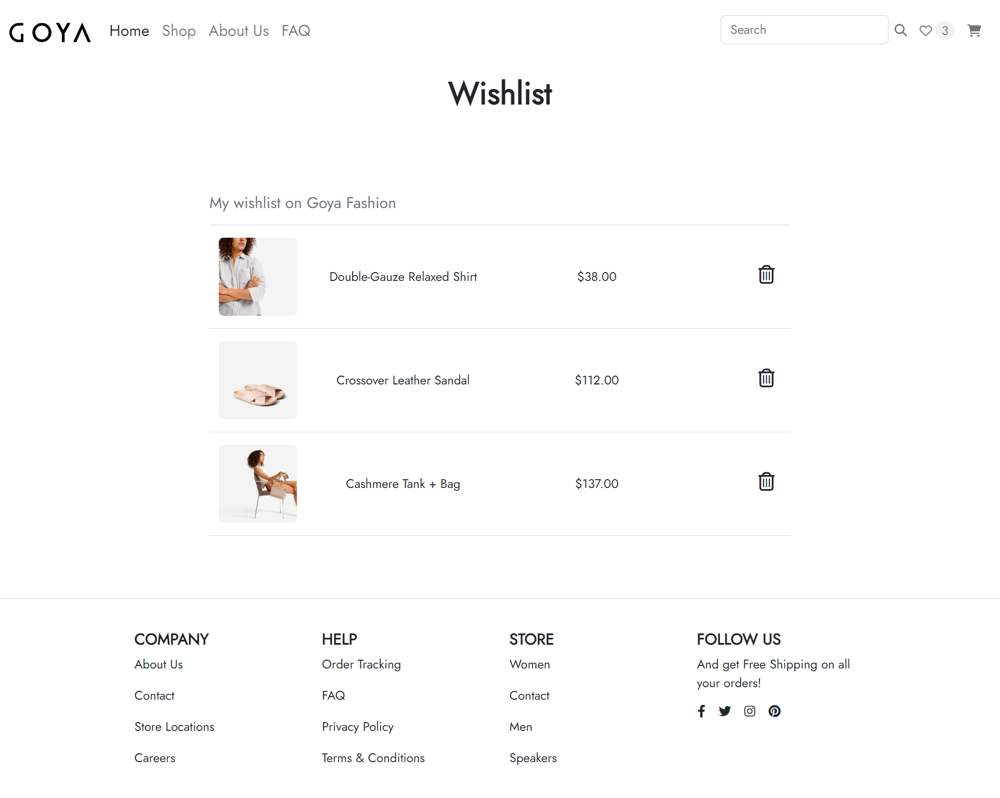

# Gaya Fashion

# E-Commerce Web Application
This is a web-based e-commerce platform built using React JS. It allows users to browse products, add them to their shopping cart, and purchase items securely.
#  Demo
- https://gaya-fashion-e-commerce.netlify.app/

## Features:

- Browse products by category
- Search for specific products by name or keyword
- View detailed product pages with images, descriptions, and reviews
- Add items to a shopping cart and adjust quantities

## Setup Instructions:

1. Clone the repository onto your local machine.
2. Install Node.js and npm if you haven't already.
3. Navigate to the project's root directory in your command line interface.
4. Run the following command: `npm install`
5. Run the following command: `npm start`

## Usage Instructions:

Once the application is up and running, you can use the following steps to navigate through the platform:

1. Browse products by selecting a category from the navigation bar or entering a search term in the search bar.
2. Click on a product to view its details, including images, descriptions, and reviews.
3. Add items to your shopping cart by clicking the "Add to Cart" button on a product page.
4. Review your cart contents by clicking the shopping cart icon in the navigation bar.
5. Adjust item quantities or remove items from your cart as desired.
6. Proceed to checkout by clicking the "Checkout" button in your cart.

## SCREENSHOTS
- Home Page
 
- Shop
 
- ProductDetail
  
- Card
 
- AboutUs
 
- Faq

- wishlist
  

## Technologies Used:

- React JS
- Bootstrap
- Font Awesome
